# GSD (Get-Shit-Done) Meta-Framework Workflow

## Overview

**GSD** is a lightweight yet powerful meta-prompting, context engineering, and spec-driven development system designed for Claude Code and OpenCode. It provides a structured approach to complex software development tasks through defined phases, artifacts, and decision points.

## Core Philosophy

GSD treats software development as a **phased workflow** with clear boundaries, documented progress, and verifiable outcomes. It emphasizes:

- **Structured Planning**: Research first, code second
- **Artifact-Driven Communication**: Use documents to track progress and decisions
- **Verification-First**: Always validate changes before completion
- **Context Engineering**: Skills and tools extend capabilities for specialized tasks

---

## Workflow Phases

The GSD framework operates through three distinct modes that guide the development process:

### 1. PLANNING Mode

**Purpose**: Research the codebase, understand requirements, and design your approach before writing code.
**Key Activities**:

- Explore project structure and dependencies
- Understand user requirements and constraints
- Research existing implementations
- Design the technical approach
- Identify potential risks and edge cases
  **Primary Artifact**: `implementation_plan.md`
  **Exit Criteria**:
- Implementation plan created and approved by user
- All technical questions answered
- Approach validated
  **Decision Points**:
- ✅ **Plan Approved** → Move to EXECUTION mode
- ❌ **Changes Requested** → Stay in PLANNING, update plan
- ⚠️ **Insufficient Information** → Notify user with questions

---

### 2. EXECUTION Mode

**Purpose**: Implement the designed solution by writing code, making changes, and building features.
**Key Activities**:

- Write production code
- Create new files and modify existing ones
- Implement features according to the plan
- Handle implementation details and edge cases
- Document code changes
  **Exit Criteria**:
- All planned changes implemented
- Code compiles/runs without errors
- Ready for verification
  **Decision Points**:
- ✅ **Implementation Complete** → Move to VERIFICATION mode
- ❌ **Unexpected Complexity** → Return to PLANNING mode
- ⚠️ **Requirements Changed** → Return to PLANNING mode

---

### 3. VERIFICATION Mode

**Purpose**: Test changes, validate correctness, and ensure the implementation meets requirements.
**Key Activities**:

- Run automated tests (unit, integration, E2E)
- Perform manual testing
- Validate against requirements
- Check for regressions
- Document test results
  **Primary Artifact**: `walkthrough.md`
  **Exit Criteria**:
- All tests passing
- Manual verification complete
- Walkthrough document created
- User notified of completion
  **Decision Points**:
- ✅ **All Tests Pass** → Complete task, create walkthrough
- ⚠️ **Minor Issues Found** → Switch to EXECUTION mode, fix issues
- ❌ **Fundamental Flaws** → Return to PLANNING mode

---

## Artifact System

GSD uses three core artifacts to track progress and communicate with users:

### task.md

**Location**: `<appDataDir>/brain/<conversation-id>/task.md`
**Purpose**: A detailed checklist to organize work and track progress.
**Format**:

```markdown
# Task: [Objective Name]

## Component 1

- [ ] Uncompleted task
- [/] In progress task
- [x] Completed task
  - [ ] Sub-task

## Component 2

- [ ] Another task
```

**Lifecycle**:

- Created at task start
- Updated as work progresses
- Items marked `[/]` when started, `[x]` when complete
- Maintained throughout all phases

---

### implementation_plan.md

**Location**: `<appDataDir>/brain/<conversation-id>/implementation_plan.md`
**Purpose**: Document technical plan during PLANNING mode for user review.
**Structure**:

```markdown
# [Goal Description]

Brief description of the problem and solution.

## User Review Required

> [!IMPORTANT]
> Breaking changes or critical decisions requiring user input.

## Proposed Changes

### Component Name

#### [MODIFY] [filename](file:///path/to/file)

- What will change and why

#### [NEW] [filename](file:///path/to/file)

- Purpose of new file

#### [DELETE] [filename](file:///path/to/file)

- Reason for deletion

## Verification Plan

### Automated Tests

- Exact commands to run
- Expected outcomes

### Manual Verification

- Step-by-step testing instructions
- What to look for
```

**Lifecycle**:

- Created during PLANNING mode
- Requested for user review via `notify_user`
- Updated based on feedback
- Archived when approved and implementation begins

---

### walkthrough.md

**Location**: `<appDataDir>/brain/<conversation-id>/walkthrough.md`
**Purpose**: Summarize completed work and verification results.
**Content**:

- Changes made with links to modified files
- Tests executed and results
- Screenshots/recordings of UI changes
- Validation outcomes
- Known limitations or follow-up items
  **Lifecycle**:
- Created after VERIFICATION mode completes
- Updated for related follow-up work
- Serves as proof of work and documentation

---

## Task Boundaries

Task boundaries define the scope and progress of work through the `task_boundary` tool.

### Key Parameters

| Parameter             | Purpose                                             | Example                                                      |
| --------------------- | --------------------------------------------------- | ------------------------------------------------------------ |
| **TaskName**          | Human-readable identifier for the current work      | "Planning Authentication System"                             |
| **Mode**              | Current phase: PLANNING, EXECUTION, or VERIFICATION | PLANNING                                                     |
| **TaskSummary**       | What has been accomplished so far (past tense)      | "Analyzed user requirements and researched OAuth libraries." |
| **TaskStatus**        | What you're about to do next (future tense)         | "Creating implementation plan for review"                    |
| **PredictedTaskSize** | Estimated tool calls remaining                      | 8                                                            |

### Granularity Guidelines

- **Change TaskName** when moving between major modes or components
- **Keep TaskName** when backtracking mid-task or adjusting approach
- Task should correspond roughly to one top-level item in `task.md`
- Avoid having one task for the entire user request

### Update Pattern

```
Initial Call:
  TaskName: "Planning Authentication"
  Mode: PLANNING
  Summary: "Starting authentication implementation"
  Status: "Researching existing auth libraries"
Progress Update (same task):
  TaskName: "Planning Authentication"  (unchanged)
  Mode: PLANNING  (unchanged)
  Summary: "Researched OAuth 2.0 libraries and analyzed project structure"
  Status: "Creating implementation plan"
New Task:
  TaskName: "Implementing User Login"
  Mode: EXECUTION
  Summary: "Plan approved. Beginning implementation."
  Status: "Creating authentication service"
```

---

## User Communication

### notify_user Tool

**Purpose**: The ONLY way to communicate with users during task mode.
**When to Use**:

- Request artifact review (include paths in `PathsToReview`)
- Ask blocking questions
- Report task completion
- Batch independent questions into one call
  **Important Parameters**:
  | Parameter | Description |
  |-----------|-------------|
  | `PathsToReview` | Absolute paths to files for user review |
  | `BlockedOnUser` | `true` if cannot proceed without approval |
  | `Message` | Concise message (don't repeat file contents) |
  | `ShouldAutoProceed` | `true` if extremely confident, changes are straightforward |
  **Effect**: Exits task view mode and returns to normal chat.

---

## Skill System

Skills extend the agent's capabilities for specialized tasks.

### Structure

Each skill is a folder containing:

- **SKILL.md** (required): Instructions with YAML frontmatter
- **scripts/**: Helper utilities
- **examples/**: Reference implementations
- **resources/**: Templates and assets

### Usage Pattern

```
1. Identify relevant skill from available list
2. Use view_file to read SKILL.md
3. Follow instructions exactly as documented
4. Leverage skill-specific tools and patterns
```

### Integration Points

- Skills inform planning decisions
- Provide best practices for implementation
- Offer specialized workflows (e.g., authentication, testing, CI/CD)
- Can be composed together for complex features

---

## Decision Flow


---

## Workflow State Transitions

### Mode Transition Rules

| From         | To           | Trigger                                                              |
| ------------ | ------------ | -------------------------------------------------------------------- |
| **(ANY)**    | PLANNING     | Unexpected complexity, fundamental design flaws, requirements change |
| PLANNING     | EXECUTION    | Implementation plan approved by user                                 |
| EXECUTION    | VERIFICATION | All planned changes implemented successfully                         |
| VERIFICATION | EXECUTION    | Minor issues or bugs found during testing (stay in same TaskName)    |
| VERIFICATION | Complete     | All tests pass, walkthrough created                                  |

### Common Patterns

#### Happy Path

```
User Request → PLANNING → EXECUTION → VERIFICATION → Complete
```

#### Discovery-Driven

```
User Request → PLANNING → EXECUTION → (discover complexity) → PLANNING → EXECUTION → VERIFICATION → Complete
```

#### Iterative Refinement

```
User Request → PLANNING → (feedback loop) → PLANNING → EXECUTION → VERIFICATION → (minor fixes) → EXECUTION → VERIFICATION → Complete
```

---

## Best Practices

### Planning Phase

- ✅ Always read existing code before proposing changes
- ✅ Search for existing tests to include in verification plan
- ✅ Document breaking changes prominently
- ✅ Ask user for help with manual testing steps if unsure
- ❌ Don't make up test commands - verify they exist
- ❌ Don't skip planning for complex changes

### Execution Phase

- ✅ Follow the implementation plan closely
- ✅ Use incremental edits rather than full file replacements
- ✅ Document non-obvious decisions in code comments
- ❌ Don't deviate from approved plan without returning to PLANNING
- ❌ Don't skip verification steps

### Verification Phase

- ✅ Run ALL relevant tests, not just new ones
- ✅ Include screenshots/recordings for UI changes
- ✅ Test edge cases and error conditions
- ✅ Document all verification steps in walkthrough
- ❌ Don't assume tests pass - actually run them
- ❌ Don't skip manual verification when appropriate

### Artifact Management

- ✅ Keep artifacts concise and scannable
- ✅ Use links to files rather than copying content
- ✅ Update task.md frequently to show progress
- ❌ Don't create redundant artifacts
- ❌ Don't duplicate information across artifacts

### User Communication

- ✅ Batch related questions together
- ✅ Be specific about what needs review
- ✅ Set appropriate BlockedOnUser flags
- ❌ Don't interrupt user unnecessarily
- ❌ Don't ask for approval on simple changes

---

## Example Workflow

### Scenario: Adding User Authentication

**Phase 1: PLANNING**

1. User requests: "Add user authentication with OAuth"
2. Create `task.md` with component breakdown
3. Research existing auth libraries and project structure
4. Create `implementation_plan.md` with:
   - OAuth provider selection
   - Database schema changes
   - API endpoint modifications
   - Security considerations
5. Notify user for plan review
6. User approves → move to EXECUTION
   **Phase 2: EXECUTION**
7. Update `task.md`: mark auth service as `[/]` in-progress
8. Install OAuth library
9. Create authentication service
10. Add database migrations
11. Implement login/logout endpoints
12. Update `task.md`: mark completed items as `[x]`
13. Code complete → move to VERIFICATION
    **Phase 3: VERIFICATION**
14. Run unit tests for auth service
15. Test OAuth flow manually
16. Verify database migrations
17. Check security headers and tokens
18. Document in `walkthrough.md`:
    - Changes made (with file links)
    - Tests executed
    - Screenshots of login flow
19. Notify user with walkthrough
20. Task complete

---

## Advanced Features

### Skill Composition

Multiple skills can work together:

```
Example: Building a Nuxt app with authentication
- Use "nuxt" skill for framework patterns
- Use "vue-best-practices" for component structure
- Use "create-auth-skill" for authentication layer
- Use "nuxt-ui" for styled components
- Use "vitest" for testing strategy
```

### Context Engineering

GSD manages context through:

- **Hierarchical organization**: Artifacts in brain directory
- **Conversation history**: Recent conversations inform decisions
- **Project workspace**: Understanding codebase structure
- **Skill knowledge**: Domain-specific best practices

### Workflow Hooks

Projects can define custom workflows in `.agent/workflows/`:

```markdown
---
description: Deploy to production
---

1. Run tests
2. Build production bundle
3. Upload to server
4. Restart services
   // turbo-all ← Auto-run all commands
```

---

## Architecture Diagram

```mermaid
graph TB
    subgraph "GSD Meta-Framework"
        User[👤 User] --> Agent[🤖 Agent]

        Agent --> TaskBoundary[Task Boundary System]
        Agent --> ArtifactSystem[Artifact System]
        Agent --> SkillSystem[Skill System]
        Agent --> ToolSystem[Tool System]

        subgraph "Modes"
            Planning[📋 PLANNING]
            Execution[⚙️ EXECUTION]
            Verification[✅ VERIFICATION]
        end

        TaskBoundary --> Planning
        TaskBoundary --> Execution
        TaskBoundary --> Verification

        subgraph "Artifacts"
            TaskMD[task.md]
            PlanMD[implementation_plan.md]
            WalkthroughMD[walkthrough.md]
        end

        ArtifactSystem --> TaskMD
        ArtifactSystem --> PlanMD
        ArtifactSystem --> WalkthroughMD

        Planning --> PlanMD
        Execution --> TaskMD
        Verification --> WalkthroughMD

        subgraph "Skills"
            Skill1[nuxt]
            Skill2[vue-best-practices]
            Skill3[create-auth-skill]
            Skill4[vitest]
            SkillN[... more skills]
        end

        SkillSystem --> Skill1
        SkillSystem --> Skill2
        SkillSystem --> Skill3
        SkillSystem --> Skill4
        SkillSystem --> SkillN

        subgraph "Tools"
            FileOps[File Operations]
            CodeSearch[Code Search]
            Terminal[Terminal Commands]
            Browser[Browser Automation]
            ImageGen[Image Generation]
        end

        ToolSystem --> FileOps
        ToolSystem --> CodeSearch
        ToolSystem --> Terminal
        ToolSystem --> Browser
        ToolSystem --> ImageGen

        Agent --> NotifyUser[notify_user]
        NotifyUser --> User
    end

    style Planning fill:#e1f5ff
    style Execution fill:#fff4e1
    style Verification fill:#e8f5e9
    style User fill:#f3e5f5
    style Agent fill:#fff9c4
```



---

## Component Details

### Task Boundary System

**Responsibilities**:

- Track current phase (PLANNING/EXECUTION/VERIFICATION)
- Maintain task context and progress
- Estimate work remaining
- Trigger mode transitions
  **Key Behaviors**:
- Use `%SAME%` to avoid repeating unchanged values
- Update TaskSummary cumulatively (what's done)
- Update TaskStatus prospectively (what's next)
- Change TaskName when switching major components

---

### Artifact System

**Responsibilities**:

- Provide structured communication channel
- Track progress and decisions
- Enable async user review
- Create audit trail
  **Key Behaviors**:
- All artifacts stored in conversation brain directory
- Markdown format with rich formatting support
- File links for navigation
- Embedde images/videos for visual proof

---

### Skill System

**Responsibilities**:

- Extend agent capabilities
- Provide domain expertise
- Enforce best practices
- Offer reusable patterns
  **Key Behaviors**:
- Must read SKILL.md before use
- Follow skill instructions exactly
- Can compose multiple skills
- Skills inform planning and execution

---

### Tool System

**Responsibilities**:

- Execute file operations
- Search codebase
- Run commands
- Automate browser interactions
- Generate images
  **Key Behaviors**:
- Tools work in parallel when independent
- Sequential execution when dependent
- Auto-run for safe commands
- User approval for destructive operations

---

## Summary

GSD (Get-Shit-Done) is a **meta-framework** that transforms unstructured development requests into **structured, phased workflows** with:

- **Clear Modes**: PLANNING → EXECUTION → VERIFICATION
- **Artifact-Driven Progress**: task.md, implementation_plan.md, walkthrough.md
- **Skill Integration**: Domain expertise and best practices
- **Tool Orchestration**: Automated file operations, testing, and verification
- **User Communication**: Async review and approval workflow
  This systematic approach ensures high-quality outcomes while maintaining visibility and control for users throughout the development process.
