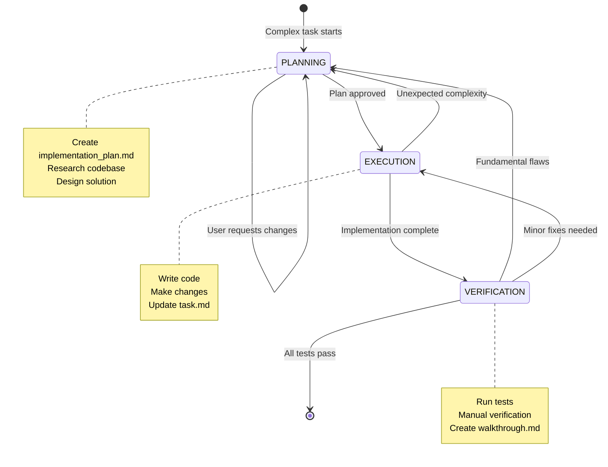
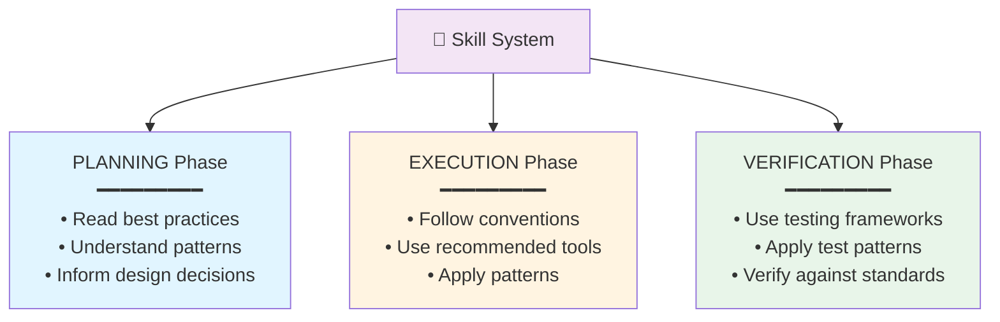

# GSD Meta-Framework Visual Flowchart

## This document provides a comprehensive visual representation of the GSD (Get-Shit-Done) meta-framework workflow.

## Complete Workflow Flowchart

```mermaid
graph TB
    Start([👤 User Submits Request]) --> Complexity{Is Task<br/>Complex?}

    %% Simple Path
    Complexity -->|"Simple:<br/>• Quick answer<br/>• 1-2 tool calls<br/>• No planning needed"| DirectAnswer[💬 Provide Direct Answer<br/>━━━━━━━━━<br/>No task boundaries<br/>No artifacts created]
    DirectAnswer --> EndSimple([✓ Complete])

    %% Complex Path - Enter Task Mode
    Complexity -->|"Complex:<br/>• Multi-step work<br/>• Code changes<br/>• Needs planning"| InitTask[📋 Initialize Task System<br/>━━━━━━━━━<br/>• Create task.md<br/>• Set TaskName<br/>• Enter PLANNING mode]

    %% PLANNING MODE
    InitTask --> PlanningMode[🔵 PLANNING MODE]

    PlanningMode --> Research[🔍 Research & Analysis<br/>━━━━━━━━━<br/>• Explore codebase<br/>• Read existing code<br/>• Find dependencies<br/>• Search for patterns<br/>• Identify constraints]

    Research --> DesignSolution[📐 Design Solution<br/>━━━━━━━━━<br/>• Choose approach<br/>• Plan file changes<br/>• Design APIs<br/>• Consider edge cases<br/>• Plan tests]

    DesignSolution --> CreatePlan[📝 Create implementation_plan.md<br/>━━━━━━━━━<br/>• Goal description<br/>• Proposed changes<br/>• File modifications<br/>• Verification plan<br/>• Breaking changes]

    CreatePlan --> NotifyPlan[📤 notify_user<br/>━━━━━━━━━<br/>• PathsToReview: plan file<br/>• BlockedOnUser: true<br/>• Exit task mode]

    NotifyPlan --> UserReview{User Reviews Plan}

    UserReview -->|"❌ Changes Requested<br/>• Different approach<br/>• Missing requirements<br/>• Concerns raised"| UpdatePlan[✏️ Update Plan<br/>━━━━━━━━━<br/>• Address feedback<br/>• Revise approach<br/>• Answer questions<br/>• Stay in PLANNING]

    UpdatePlan --> NotifyPlan

    UserReview -->|"✅ Approved<br/>• Plan looks good<br/>• Ready to proceed<br/>• No blockers"| ExecMode

    %% EXECUTION MODE
    ExecMode[🟡 EXECUTION MODE] --> UpdateTask1[📝 Update task.md<br/>━━━━━━━━━<br/>Mark items as [/] in-progress]

    UpdateTask1 --> WriteCode[⚙️ Implement Changes<br/>━━━━━━━━━<br/>• Create new files<br/>• Modify existing code<br/>• Install dependencies<br/>• Update configs<br/>• Add tests]

    WriteCode --> CheckExec{Implementation<br/>Status?}

    CheckExec -->|"⚠️ Unexpected Complexity<br/>• Design flaws found<br/>• Requirements unclear<br/>• Need different approach"| BackToPlan[🔄 Return to PLANNING<br/>━━━━━━━━━<br/>• Update plan<br/>• Rethink approach<br/>• Notify user if needed]

    BackToPlan --> PlanningMode

    CheckExec -->|"✅ Changes Complete<br/>• All files modified<br/>• Code compiles<br/>• Ready to test"| UpdateTask2[📝 Update task.md<br/>━━━━━━━━━<br/>Mark completed items as [x]]

    UpdateTask2 --> VerifyMode

    %% VERIFICATION MODE
    VerifyMode[🟢 VERIFICATION MODE] --> RunTests[🧪 Execute Tests<br/>━━━━━━━━━<br/>• Run unit tests<br/>• Run integration tests<br/>• Run E2E tests<br/>• Check build status<br/>• Lint code]

    RunTests --> ManualTest[👁️ Manual Verification<br/>━━━━━━━━━<br/>• Test UI changes<br/>• Verify functionality<br/>• Check edge cases<br/>• Take screenshots<br/>• Record demos]

    ManualTest --> TestResults{Test<br/>Results?}

    TestResults -->|"❌ Fundamental Flaws<br/>• Design doesn't work<br/>• Wrong approach<br/>• Major issues"| BackToPlan2[🔄 Return to PLANNING<br/>━━━━━━━━━<br/>• Create new TaskName<br/>• Redesign solution<br/>• Update plan]

    BackToPlan2 --> PlanningMode

    TestResults -->|"⚠️ Minor Issues<br/>• Small bugs<br/>• Edge cases<br/>• Simple fixes"| QuickFix[🔧 Quick Fix<br/>━━━━━━━━━<br/>• Stay in same TaskName<br/>• Switch to EXECUTION<br/>• Fix issues<br/>• Return to VERIFICATION]

    QuickFix --> ExecMode

    TestResults -->|"✅ All Tests Pass<br/>• Everything works<br/>• No regressions<br/>• Requirements met"| CreateWalkthrough[📄 Create walkthrough.md<br/>━━━━━━━━━<br/>• Summarize changes<br/>• Document tests<br/>• Include screenshots<br/>• Link to files<br/>• Note limitations]

    CreateWalkthrough --> FinalNotify[📤 notify_user<br/>━━━━━━━━━<br/>• PathsToReview: walkthrough<br/>• BlockedOnUser: false<br/>• Task complete message]

    FinalNotify --> EndComplex([✓ Task Complete])

    %% Styling
    classDef planningStyle fill:#e1f5ff,stroke:#01579b,stroke-width:2px
    classDef executionStyle fill:#fff4e1,stroke:#e65100,stroke-width:2px
    classDef verificationStyle fill:#e8f5e9,stroke:#1b5e20,stroke-width:2px
    classDef decisionStyle fill:#fff3e0,stroke:#e65100,stroke-width:2px
    classDef artifactStyle fill:#f3e5f5,stroke:#4a148c,stroke-width:2px
    classDef userStyle fill:#fce4ec,stroke:#880e4f,stroke-width:2px
    classDef endStyle fill:#e0e0e0,stroke:#424242,stroke-width:2px

    class PlanningMode,Research,DesignSolution,CreatePlan,BackToPlan,BackToPlan2 planningStyle
    class ExecMode,UpdateTask1,WriteCode,QuickFix executionStyle
    class VerifyMode,RunTests,ManualTest,CreateWalkthrough verificationStyle
    class Complexity,UserReview,CheckExec,TestResults decisionStyle
    class NotifyPlan,FinalNotify,DirectAnswer userStyle
    class InitTask,UpdateTask2 artifactStyle
    class Start,EndSimple,EndComplex endStyle
```

---

## Node Explanations

### Entry Point

#### 👤 User Submits Request

**Type**: Entry point  
**Description**: User provides a request, question, or task to the agent  
**Examples**:

- "Add user authentication to this app"
- "Fix the bug where dates display incorrectly"
- "How does the routing system work?"
  **Decision**: Is this a complex task requiring structured workflow?

---

### Decision Nodes

#### Is Task Complex?

**Type**: Decision point  
**Criteria**:

- **Simple** (no task boundaries):
  - Answering questions
  - Quick refactors
  - Single-file edits
  - 1-2 tool calls
  - No planning needed
- **Complex** (use task boundaries):
  - Multi-file changes
  - New features
  - Architecture changes
  - Requires planning
  - Needs verification
    **Outputs**:
- ✅ Simple → Direct answer, no artifacts
- ✅ Complex → Enter task mode with PLANNING

---

#### User Reviews Plan

**Type**: User interaction  
**Description**: User reviews the implementation_plan.md and provides feedback
**Possible Outcomes**:

- ✅ **Approved**: Plan is good, proceed to EXECUTION
- ❌ **Changes Requested**: User wants different approach, stay in PLANNING
- ❓ **Questions**: User needs clarification, answer and re-submit
  **Context**: Agent is in "notify_user" state, waiting for user response

---

#### Implementation Status?

**Type**: Decision point during EXECUTION  
**Criteria**:

- **Unexpected Complexity**: Design flaws discovered, return to PLANNING
- **Requirements Changed**: User provides new info, return to PLANNING
- **Changes Complete**: All code written successfully, proceed to VERIFICATION
  **Trigger**: Completion of code implementation phase

---

#### Test Results?

**Type**: Decision point during VERIFICATION  
**Criteria**:

- **All Tests Pass** ✅:
  - Unit tests passing
  - Integration tests passing
  - Manual verification successful
  - No regressions
    → Create walkthrough and complete
- **Minor Issues** ⚠️:
  - Small bugs found
  - Edge cases
  - Simple fixes needed
    → Switch to EXECUTION (same TaskName), fix, return to VERIFICATION
- **Fundamental Flaws** ❌:
  - Design doesn't work
  - Wrong approach taken
  - Major issues
    → Return to PLANNING with new TaskName
    **Trigger**: Completion of test execution and manual verification

---

### PLANNING Mode Nodes

#### 🔵 PLANNING MODE

**Phase**: Research and Design  
**Purpose**: Understand requirements and create a solid plan before coding  
**Primary Artifact**: implementation_plan.md
**Key Principles**:

- Research first, code second
- Understand existing patterns
- Plan for testing
- Identify risks early

---

#### 🔍 Research & Analysis

**Activities**:

- Use `view_file_outline` to understand file structure
- Use `grep_search` to find patterns and dependencies
- Use `find_by_name` to locate relevant files
- Read existing implementations
- Identify constraints and edge cases
  **Tools Used**:
- `view_file`, `view_file_outline`
- `grep_search`, `find_by_name`
- `view_code_item`
- Skill system (read SKILL.md files)
  **Output**: Understanding of codebase and requirements

---

#### 📐 Design Solution

**Activities**:

- Choose technical approach
- Plan file modifications (NEW, MODIFY, DELETE)
- Design APIs and interfaces
- Consider edge cases and error handling
- Plan verification strategy
  **Considerations**:
- Existing code patterns
- Project conventions
- Performance implications
- Security concerns
- Breaking changes
  **Output**: Technical design ready for documentation

---

#### 📝 Create implementation_plan.md

**Location**: `<appDataDir>/brain/<conversation-id>/implementation_plan.md`
**Structure**:

```markdown
# Goal Description

Brief overview of problem and solution

## User Review Required

> [!IMPORTANT]
> Breaking changes or critical decisions

## Proposed Changes

### Component Name

#### [MODIFY] filename

- What will change

### Another Component

#### [NEW] filename

- Purpose of new file

## Verification Plan

- Automated tests to run
- Manual verification steps
```

## **Purpose**: Document plan for user review before implementation

#### ✏️ Update Plan

**Trigger**: User requests changes to the plan  
**Activities**:

- Address user feedback
- Revise technical approach
- Answer questions
- Update implementation_plan.md
- Stay in PLANNING mode
  **Output**: Updated plan ready for re-review

---

### EXECUTION Mode Nodes

#### 🟡 EXECUTION MODE

**Phase**: Implementation  
**Purpose**: Write code and make changes according to the approved plan  
**Primary Artifact**: task.md (updated with progress)
**Key Principles**:

- Follow the approved plan
- Use incremental edits
- Document non-obvious decisions
- Update task.md frequently

---

#### ⚙️ Implement Changes

**Activities**:

- Create new files with `write_to_file`
- Modify existing files with `replace_file_content` or `multi_replace_file_content`
- Install dependencies with `run_command`
- Update configurations
- Add/update tests
  **Tools Used**:
- `write_to_file`
- `replace_file_content`
- `multi_replace_file_content`
- `run_command`
  **Best Practices**:
- Make incremental changes
- Test as you go
- Follow project conventions
- Add comments for complex logic
  **Output**: Implementation complete, ready for testing

---

#### 🔄 Return to PLANNING

**Triggers**:

- Unexpected complexity discovered
- Design flaws found
- Requirements unclear
- Wrong approach taken
  **Activities**:
- Create new TaskName if fundamental change
- Update implementation_plan.md with new approach
- Notify user if decisions needed
- Re-enter PLANNING mode
  **Purpose**: Avoid wasting time on wrong implementation

---

### VERIFICATION Mode Nodes

#### 🟢 VERIFICATION MODE

**Phase**: Testing and Validation  
**Purpose**: Ensure implementation works correctly and meets requirements  
**Primary Artifact**: walkthrough.md
**Key Principles**:

- Test everything, not just new code
- Include edge cases
- Document all verification steps
- Don't assume - actually run tests

---

#### 🧪 Execute Tests

**Activities**:

- Run unit tests
- Run integration tests
- Run E2E tests
- Check build status
- Run linters and type checkers
  **Commands** (examples):

```bash
npm test
npm run test:unit
npm run test:e2e
npm run build
npm run lint
```

## **Output**: Test results and build status

#### 👁️ Manual Verification

**Activities**:

- Test UI changes visually
- Verify user flows work
- Test edge cases manually
- Take screenshots with browser tool
- Record video demonstrations
  **Tools Used**:
- `browser_subagent` for UI testing
- Manual interaction
- Screenshots and recordings
  **Output**: Visual proof of functionality

---

#### 📄 Create walkthrough.md

**Location**: `<appDataDir>/brain/<conversation-id>/walkthrough.md`
**Content**:

```markdown
# Changes Summary

- Modified [file.ts](file:///path/to/file.ts)
- Added new feature X
- Fixed bug Y

# Testing Results

## Automated Tests

✅ All unit tests passing
✅ Integration tests passing

## Manual Verification

- Tested login flow
- Verified edge cases
  

# Known Limitations

- Issue X requires follow-up
```

## **Purpose**: Document completed work and proof of verification

#### 🔧 Quick Fix

**Trigger**: Minor issues found during verification  
**Strategy**: Stay in same TaskName, switch to EXECUTION mode
**Activities**:

- Fix small bugs
- Handle edge cases
- Make simple adjustments
- Return to VERIFICATION to re-test
  **When NOT to use**:
- Fundamental design flaws → return to PLANNING instead
- Major changes needed → return to PLANNING instead

---

### Communication Nodes

#### 📤 notify_user

**Purpose**: ONLY way to communicate with user during task mode
**Parameters**:

- `PathsToReview`: Absolute paths to files for review
- `BlockedOnUser`: `true` if waiting for approval, `false` if just informing
- `Message`: Concise message (don't repeat file contents)
- `ShouldAutoProceed`: `true` only if extremely confident
  **Effect**: Exits task mode, returns control to user
  **Use Cases**:
- Request plan review
- Ask blocking questions
- Report completion
- Request clarification

---

### Artifact Nodes

#### 📋 Initialize Task System

**Activities**:

- Create task.md with checklist
- Call `task_boundary` tool
- Set initial TaskName
- Enter PLANNING mode
- Set predicted task size
  **task.md Format**:

```markdown
# Task: [Objective]

## Component 1

- [ ] Uncompleted
- [/] In progress
- [x] Completed

## Component 2

- [ ] Another task
```

## **Purpose**: Enter structured task workflow

#### 📝 Update task.md

**Timing**: Throughout EXECUTION phase  
**Updates**:

- Mark items `[/]` when starting
- Mark items `[x]` when complete
- Add new items if scope expands
  **Purpose**: Track progress and maintain context

---

## Artifact Lifecycle

```mermaid
graph LR
    subgraph "Task Lifecycle"
        T1[task.md created] --> T2[Items marked [/] in-progress]
        T2 --> T3[Items marked [x] complete]
        T3 --> T4[Task complete]
    end

    subgraph "Plan Lifecycle"
        P1[plan.md created] --> P2[User reviews]
        P2 --> P3{Approved?}
        P3 -->|No| P4[Updated]
        P4 --> P2
        P3 -->|Yes| P5[Archived/Reference]
    end

    subgraph "Walkthrough Lifecycle"
        W1[Verification complete] --> W2[walkthrough.md created]
        W2 --> W3[User notified]
        W3 --> W4[Serves as documentation]
    end

    style T2 fill:#fff4e1
    style T3 fill:#e8f5e9
    style P4 fill:#e1f5ff
    style W2 fill:#e8f5e9
```

---

## Mode Transition Diagram



---

## Skill Integration Points

Skills can be leveraged at any phase:



### Example Skill Usage

**Scenario**: Building a Nuxt app with authentication

1. **PLANNING**:
   - Read `nuxt` skill for framework conventions
   - Read `create-auth-skill` for auth patterns
   - Read `nuxt-ui` for component options
2. **EXECUTION**:
   - Follow `vue-best-practices` for component structure
   - Use `better-auth-best-practices` for security
   - Apply `vueuse-functions` for composables
3. **VERIFICATION**:
   - Use `vitest` for testing strategy
   - Use `vue-testing-best-practices` for component tests
   - Browser automation for E2E flows

---

## Summary

This flowchart visualizes the complete GSD meta-framework workflow:

- **Entry Point**: User request → Complexity assessment
- **Simple Path**: Direct answer, no task boundaries
- **Complex Path**: PLANNING → EXECUTION → VERIFICATION
- **Decision Points**: Plan review, implementation status, test results
- **Artifacts**: task.md, implementation_plan.md, walkthrough.md
- **Communication**: notify_user for user interaction
- **Skill Integration**: Domain expertise throughout phases
  The framework ensures **structured**, **verifiable**, and **user-guided** software development.
