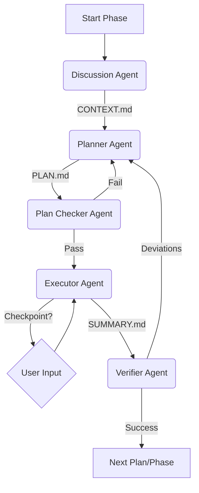

# Agent Orchestration & Spawning Patterns

## The "One-Shot" Agent Lifecycle

In this framework, agents are designed as **Ephemeral processes**. They are not "chatbots" that maintain a session. They are "functions" backed by an LLM.

### Lifecycle:

1.  **Spawn**: Agent starts with a System Prompt + Specific Task Input.
2.  **Execute**: Agent performs tool calls (research, write, edit).
3.  **Artifact**: Agent produces a structured artifact (Markdown/XML/JSON).
4.  **Terminate**: Agent process ends. Context is discarded.

## Subagent Specialization

Agents are highly specialized to reduce prompt complexity. A "Generalist" agent is an anti-pattern.

### 1. The Planner (`gsd-planner`)

- **Role**: Architect.
- **Input**: `CONTEXT.md`, Goals.
- **Output**: `PLAN.md` (XML-structured prompts).
- **Behavior**: High reasoning, low execution. Does not touch code.
- **Key Trait**: "Goal-Backward Planning" (Derives tasks from required distinct outcomes).

### 2. The Executor (`gsd-executor`)

- **Role**: Builder.
- **Input**: `PLAN.md`.
- **Output**: Code Commits + `SUMMARY.md`.
- **Behavior**: High tool usage, strict adherence to plan.
- **Key Trait**: "Atomic Commits" (Commit after every task).

### 3. The Verifier (`gsd-verifier`)

- **Role**: QA / Auditor.
- **Input**: Codebase state, `REQUIREMENTS.md`.
- **Output**: `VERIFICATION.md` (Pass/Fail + Fix Suggestions).
- **Behavior**: Skeptical, focused on "observable truths" rather than code existence.

## Orchestration Logic (The "Meta-Loop")

The orchestration layer manages the flow between these agents.

## Passing Context via Artifacts

Agents do not communicate directly. They communicate via **Artifacts**.

- **Planner** writes `PLAN.md`.
- **Executor** reads `PLAN.md` and writes `SUMMARY.md`.
- **Verifier** reads `SUMMARY.md`.

This "File-based Bus" ensures:

1.  **Persistability**: If the system crashes, state is saved on disk.
2.  **Auditability**: User can read the intermediate thoughts.
3.  **Debuggability**: You can inspect `PLAN.md` to see why the Executor failed.

## Parallelization (Waves)

To accelerate development, the Planner assigns "Waves" to plans.

- **Wave 1**: Independent foundations (e.g., Database Schema, Basic UI Shell).
- **Wave 2**: Dependents (e.g., API routes that need the Schema).

The Orchestrator spawns multiple **Executor Agents** in parallel for plans in the same wave. This uses the LLM's massive parallel capacity.
